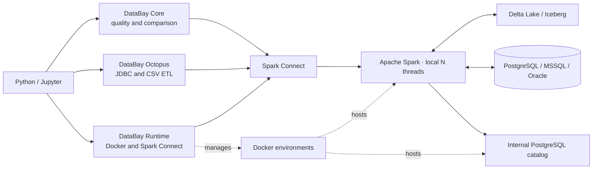

# DataBay

**Data quality and comparison tooling for lakehouse datasets**

[](https://www.python.org/downloads/)
[](https://spark.apache.org/)
[](LICENSE)

DataBay is a Python library designed for data engineers working with Apache Spark and lakehouse architectures. It brings profiling, dataset comparison, JDBC operations, and Spark runtime management into a local workflow for analytics and reverse engineering.

See the [API usage guide](docs/api-guide.md) for choosing profiling functions,
interpreting results, JDBC options and bounded Pandas conversion.

## Architecture



DataBay runs in Python or Jupyter and sends work through Spark Connect to a local Docker runtime. Choose Delta Lake or Iceberg; Spark accesses lakehouse files, mounted CSV data and JDBC databases. Internal PostgreSQL stores catalog metadata. The separate `psg-db` is an optional, disposable database for query experiments and JDBC tests.

## Why I Built This

I built DataBay for work that sits between data engineering, analytics, and reverse engineering unfamiliar systems: inspect datasets, discover keys and relationships, compare environments, and test ETL assumptions.

It gives me a reproducible Spark workspace on my own machine. I can develop and validate an approach locally, then adapt it to Microsoft Fabric or Databricks for larger workloads.

## Installation

After obtaining the author's permission, clone the repository and install it in your Python environment:

```bash
git clone https://github.com/Majo0101/DataBay.git
cd DataBay
python -m pip install -e .
```

### Requirements

- Python 3.10+; a virtual environment is recommended.
- PySpark 4.0.1 and Spark Connect dependencies are installed with DataBay.
- Docker Desktop with Linux containers for the Spark runtime.
- Jupyter/IPython for notebook magic. If needed, install with `python -m pip install jupyterlab` and run `jupyter lab` from the same environment.

## Local Testing

Activate the Conda environment where DataBay is installed, then install the
development dependencies from the repository root:

```bash
conda activate YOUR_ENV_NAME
python -m pip install -e ".[dev]"
```

Replace `YOUR_ENV_NAME` with the name of your Conda environment.

For the fast test suite, which does not require Docker containers, run:

```bash
python -m pytest -m "not integration"
```

The full suite requires the Delta Spark runtime on port `15002`, the disposable
PostgreSQL test database on port `5432`, and locally built Delta and Iceberg
images. Start the required services from the repository root:

```bash
docker compose -f infra/delta_jdbc/docker-compose.yml up -d --build
docker compose -f infra/psg_db/docker-compose.yml up -d --build
docker build -t spark-pg-iceberg infra/iceberg_jdbc
docker compose -f infra/delta_jdbc/docker-compose.yml ps
docker compose -f infra/psg_db/docker-compose.yml ps
```

The image names are significant: the tests expect `spark-pg-delta` and
`spark-pg-iceberg`. The Iceberg test starts and removes its own temporary
container from the prebuilt image. Both Spark runtimes map
`host.docker.internal` to Docker's host gateway. This is required by Docker
Engine on Linux and is compatible with Docker Desktop on Windows. Once the two
persistent services are ready, run the full suite:

```bash
python -m pytest
```

The full suite includes large JDBC writes and can take considerably longer than
the fast suite. See the detailed runtime guides for [Delta](infra/delta_jdbc/README.md),
[Iceberg](infra/iceberg_jdbc/README.md), and [PostgreSQL](infra/psg_db/README.md).

## Quick Start

### 1. Initialize Spark with Docker

Build the image once from the repository root:

```bash
docker build -t spark-pg-delta infra/delta_jdbc
```

Then run in your notebook. Adjust the heap and worker threads for your laptop:

```python
from databay.runtime.docker import DockConfig, dock_spark_init

# Configure Spark container
config = DockConfig(
    image="spark-pg-delta",
    name="databay-spark",
    ports={
        "4040/tcp": 4040,
        "15002/tcp": 15002,
    },
    named_volumes={
        "spark-lakehouse": "/lakehouse",
        "spark-metastore": "/metastore/pgdata",
    },
    env={
        "SPARK_MEMORY": "8",
        "SPARK_CORES": "4",
    },
)

# Start container, connect and register SQL magic
spark = dock_spark_init(config)
```

Spark UI: [localhost:4040](http://localhost:4040). Keep the default ports free of
other Spark containers. On first startup, if the server is still warming up,
rerun initialization or pass `connect_timeout=60`.

### 2. Data Quality Analysis

```python
from databay import (
    compare_datasets,
    duplicate_check,
    null_rate,
    select_informative_columns,
)

df = spark.createDataFrame(
    [
        (1, "Ana", "SK"),
        (2, "Peter", "SK"),
        (2, None, "SK"),
    ],
    "customer_id long, name string, country string",
)
df.createOrReplaceTempView("customers")

# Show columns with at least 5% NULLs
null_rate(df, threshold=5.0).show()

# Keep fields with changing values and inspect each decision
clean_df, column_report = select_informative_columns(
    df,
    min_distinct_values=2,
    preserve=["customer_id"],
    return_report=True,
)
column_report.show()

# Find repeated keys
duplicate_check(df, cols=["customer_id"]).show()

# Compare a second dataset
df_test = spark.createDataFrame(
    [
        (1, "Anna", "SK"),
        (2, "Peter", "SK"),
    ],
    df.schema,
)
comparison = compare_datasets(
    df_a=df,
    df_b=df_test,
    cols=["customer_id", "name", "country"],
)
comparison.show()
```

For your own CSV, add a host-to-container mapping to `config.bind_mounts` before creating the container, then read the container path with `spark.read.csv(...)`.

### 3. Column-by-Column Comparison

```python
from databay import compare_columns_by_key

# Detailed comparison by key
diff_analysis = compare_columns_by_key(
    df_a=df,
    df_b=df_test,
    key_cols=["customer_id"],
    compare_cols=["name", "country"],
    show_summary_only=False
)
diff_analysis.show()
```

### 4. ETL Operations with Octopus

With the optional test PostgreSQL running and `.env` configured below:

```python
from databay.etl import Octopus

octopus = Octopus(
    env_file=".env",
    spark=spark,
    engine="postgresql",
)

# Write to the test database; cap parallelism for this table write
octopus.write_jdbc(
    data=df,
    target_table="customers_demo",
    mode="overwrite",
    num_partitions=2,
)

# Read back as a lazy Spark DataFrame
queries = [
    ("SELECT * FROM customers_demo", "customers"),
]

frames = octopus.read_jdbc(queries=queries)
frames["customers"].show()
```

To load JDBC results into lakehouse tables, choose the server's format:

```python
# Delta runtime (default format)
octopus.feed_spark(
    queries=queries,
    target_schema="analytics",
)

# Alternatively, with an Octopus instance connected to the Iceberg runtime
octopus.feed_spark(
    queries=queries,
    target_schema="lake.analytics",
    table_format="iceberg",
)
```

Both replace destination data. Iceberg also replaces the table schema. The server
must already support the selected format and catalog; this is not a format conversion.

### 5. Jupyter Magic Commands

Magics were registered in step 1. Run each example in its own notebook cell:

```sql
%%sparksql
SELECT
    country,
    COUNT(*) AS rows
FROM customers
GROUP BY country
```

```sql
%%sparksql customers_df
SELECT *
FROM customers
WHERE name IS NOT NULL
```

```sql
%%sparksql pandas customers_pd --limit 5000
SELECT *
FROM customers
ORDER BY customer_id, name
```

These display Spark results, assign a Spark DataFrame, and display/assign a Pandas
DataFrame respectively. Use `%%sparksql view view_name` to register a temporary view.

## Module Overview

### `databay.core`

#### **metrics.py**
- `compare_datasets()` - Full dataset comparison with similarity metrics
- `compare_columns_by_key()` - Key-based column comparison
- `compare_schema()` - Schema structure comparison
- `numeric_diff_check()` - Numeric value deviation analysis
- `find_key_set()` - Locate known key values across tables and columns

#### **quality.py**
- `select_informative_columns()` - Remove empty, sparse, or constant columns with an optional decision report
- `null_rate()` - Missing value statistics
- `pk_uniqueness_check()` - Primary key validation
- `duplicate_check()` - Duplicate record detection
- `regex_check()` / `row_level_rules()` - Format and SQL rule validation
- `cardinality_check()` / `cardinality_check_tables()` - Relationship profiling

### `databay.etl`

#### **octopus.py**
- `Octopus` class - Multi-database ETL orchestrator
  - `.read_jdbc()` - Read JDBC results into DataFrames
  - `.feed_spark()` - Load to Delta or Iceberg tables
  - `.write_jdbc()` - Write DataFrames to JDBC tables
  - `.load_csv()` - Import CSV from volumes

### `databay.runtime`

#### **docker.py**
- `DockConfig` - Container configuration dataclass
- `dock()` - Start/reuse Spark containers
- `dock_spark_init()` - Complete initialization workflow
- `dock_shutdown()` - Graceful container shutdown

#### **spark.py**
- `spark_connect()` - Spark Connect protocol connection
- `sparksql_magic()` - Register Jupyter cell magics
- `is_port_open()` - Network port availability check

## Design Decisions and Limitations

- Local capacity depends on your laptop. Start with representative data and summary outputs.
- Some checks scan sources more than once; cache ownership stays with the caller.
- Duplicate join keys can multiply comparison rows. Validate candidate keys first.
- `min_distinct_values=1` keeps constants; use `2` for varying fields. Numeric comparisons do not classify NULL operands as matching or differing.
- Pandas defaults to 10000 rows and warns on truncation. Row limits do not cap RAM; without `ORDER BY`, the selected rows are not guaranteed.
- JDBC write partitions default to 4 per table. Parallel reads are opt-in; their bounds divide work, not filter rows.
- The separate PostgreSQL test container uses disposable storage and relaxed durability.
- Spark Connect reattachable execution is disabled by default because PySpark
  4.0.1 can deadlock after many short actions. Pass
  `reattachable_execute=True` to `spark_connect()` when stream recovery is
  required and the client version does not exhibit this issue.

See the [API guide](docs/api-guide.md) and function help in Pylance for details.

## Configuration

### Docker Container Setup

For the Python workflow above, set resources in `DockConfig.env`:

```python
env={
    "SPARK_MEMORY": "8",  # Driver Java heap in GiB; allow extra RAM for overhead
    "SPARK_CORES": "4",   # Worker threads, not a hard container CPU limit
}
```

`DockConfig` also supports port mappings, named volumes and bind mounts.
An existing container is reused by name; changing configuration requires
recreating it. Named volumes retain the lakehouse data.

If you use Compose instead, edit its environment settings and apply them with
`docker compose up -d` from the runtime directory. Use
`docker compose up -d --build` after editing the Dockerfile or startup script.

See [Delta configuration](infra/delta_jdbc/README.md) or
[Iceberg configuration](infra/iceberg_jdbc/README.md) for optional tuning overrides.

### Database Credentials (.env)

Example for the optional PostgreSQL test container:

```env
HOST=host.docker.internal
PORT=5432
DATABASE=testdb
USER=test_user
PASSWORD=test_pass
```

The database host must be reachable from Spark inside Docker.
`host.docker.internal` targets your host on Docker Desktop.
Use your database's credentials for other JDBC sources.

## License

DataBay is the work of **Marian Bodnar**. All rights to the original DataBay code
and documentation are reserved. Use requires prior written permission from the
author; contact [bodnar.marian@gmail.com](mailto:bodnar.marian@gmail.com).

Third-party technologies retain their own copyrights and licenses. See [LICENSE](LICENSE) for the full terms.

## Author

**Marian Bodnar**  
Email: bodnar.marian@gmail.com

## Acknowledgments

- Built on Apache Spark and PySpark
- Docker integration via `docker-py`
- Inspired by modern lakehouse architectures (Delta Lake, Iceberg)

---

**DataBay** - Making data quality analysis simple and accessible for data engineers.
