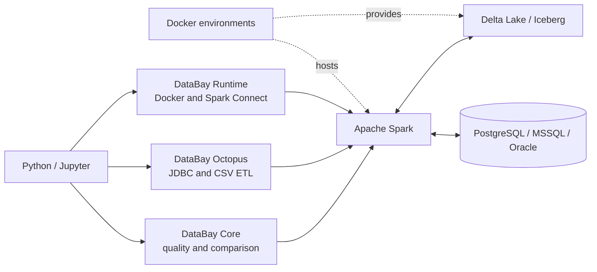

# DataBay

**Data quality and comparison tooling for lakehouse datasets**

[](https://www.python.org/downloads/)
[](https://spark.apache.org/)
[](LICENSE)

DataBay is a Python library designed for data engineers working with Apache Spark and lakehouse architectures. It provides a comprehensive suite of tools for data quality analysis, dataset comparison, ETL operations, and Spark runtime management.

## Architecture



DataBay runs from Python or Jupyter, delegates distributed processing to Spark, and connects Spark to lakehouse storage, mounted CSV data, and JDBC databases. The included Docker environments provide reproducible Delta Lake and Iceberg runtimes for local development and integration testing.

## Why I Built This

I built DataBay because much of my work sits between data engineering, data science, and reverse engineering unfamiliar data systems. I regularly need to inspect new datasets, discover relationships and candidate keys, compare environments, validate assumptions, and test ETL behavior before committing a solution to a larger platform.

Doing that work directly in a shared cloud environment can make the feedback loop slower and more expensive than it needs to be. DataBay gives me a fast, reproducible Spark and lakehouse workspace on my own machine, together with reusable tools for profiling, reconciliation, quality checks, JDBC movement, and integration testing.

My typical workflow is to develop and validate a representative small-scale solution locally, then transfer the proven approach to Microsoft Fabric or Databricks for production-scale execution. DataBay is the bridge between those stages: small enough for rapid experimentation, but built around the same Spark, SQL, Delta Lake, Iceberg, and JDBC concepts used in larger data platforms.


## Installation

```bash
pip install -e .
```

### Requirements
- Python 3.10+
- Apache Spark 4.0+ (via PySpark)
- Docker (for container runtime features)

## Local Testing

DataBay keeps lightweight tests separate from tests that require Docker, Spark, Delta Lake, or PostgreSQL. The repository includes a PowerShell runner for the `databay-0.3-test` Conda environment:

```powershell
# Unit tests and mocked runtime tests
powershell -ExecutionPolicy Bypass -File .\scripts\test.ps1 fast

# Spark, Delta Lake, CSV, and JDBC tests (excluding the largest workload)
powershell -ExecutionPolicy Bypass -File .\scripts\test.ps1 integration

# Long-running integration tests, including the 10-million-row JDBC write
powershell -ExecutionPolicy Bypass -File .\scripts\test.ps1 slow

# Complete suite
powershell -ExecutionPolicy Bypass -File .\scripts\test.ps1 all
```

The integration modes expect the `spark-pg-delta` and `psg-db` containers described under `infra/` to be running. The CSV integration test uses the repository-owned fixture in `data/landing`.

## Quick Start

### 1. Initialize Spark with Docker

```python
from databay.runtime.docker import DockConfig, dock_spark_init

# Configure Spark container
config = DockConfig(
    image="spark-delta-pg",
    name="databay-spark",
    ports={"4040/tcp": 4040, "15002/tcp": 15002},
    named_volumes={
        "spark-lakehouse": "/lakehouse",
        "spark-metastore": "/metastore/pgdata"
    }
)

# Start container and get SparkSession
spark = dock_spark_init(config)
```

### 2. Data Quality Analysis

```python
from databay import (
    compare_datasets,
    duplicate_check,
    null_rate,
    select_informative_columns,
)

# Check null rates across columns
null_analysis = null_rate(df, threshold=5.0)  # Only show columns with >5% nulls
null_analysis.show()

# Remove empty, sparse, or constant columns and inspect each decision
clean_df, column_report = select_informative_columns(
    df,
    min_distinct_values=2,
    preserve=["customer_id"],
    return_report=True,
)
column_report.show()

# Find duplicate records
duplicates = duplicate_check(df, subset=["id", "customer_name"])
duplicates.show()

# Compare two datasets
comparison = compare_datasets(
    df_prod, df_test,
    cols=["id", "name", "value"],
    name_a="Production",
    name_b="Test"
)
comparison.show()
```

### 3. Column-by-Column Comparison

```python
from databay import compare_columns_by_key

# Detailed comparison by key
diff_analysis = compare_columns_by_key(
    df_a=prod_data,
    df_b=test_data,
    key_cols=["customer_id"],
    compare_cols=["name", "email", "balance"],
    show_summary_only=False
)
diff_analysis.show()
```

### 4. ETL Operations with Octopus

```python
from databay.etl import Octopus

# Initialize with database credentials
octopus = Octopus(env_file=".env", spark=spark, engine="postgresql")

# Extract data from database
queries = [
    ("SELECT * FROM customers", "customers"),
    ("SELECT * FROM orders", "orders")
]
octopus.feed_spark(
    queries=queries,
    target_schema="analytics",
    batch_size=10000,
    num_partitions=4
)

# Now query in Spark
spark.sql("SELECT * FROM analytics.customers").show()
```

### 5. Jupyter Magic Commands

```python
# Register magics (done automatically by dock_spark_init)
from databay.runtime.spark import sparksql_magic
sparksql_magic(spark)
```

```sql
%%sparksql
SELECT customer_id, COUNT(*) as order_count
FROM analytics.orders
GROUP BY customer_id
ORDER BY order_count DESC
LIMIT 10
```

```python
# Save query results to variable
%%sparksql top_customers
SELECT * FROM analytics.customers WHERE tier = 'platinum'
```

## Module Overview

### `databay.core`

#### **metrics.py**
- `compare_datasets()` - Full dataset comparison with similarity metrics
- `compare_columns_by_key()` - Key-based column comparison
- `compare_schema()` - Schema structure comparison
- `numeric_diff_check()` - Numeric value deviation analysis

#### **quality.py**
- `select_informative_columns()` - Remove empty, sparse, or constant columns with an optional decision report
- `null_rate()` - Missing value statistics
- `pk_uniqueness_check()` - Primary key validation
- `duplicate_check()` - Duplicate record detection

### `databay.etl`

#### **octopus.py**
- `Octopus` class - Multi-database ETL orchestrator
  - `.read_jdbc()` - Read JDBC results into DataFrames
  - `.feed_spark()` - Load to Spark Delta tables
  - `.write_jdbc()` - Write DataFrames to JDBC tables
  - `.load_csv()` - Import CSV from volumes

### `databay.runtime`

#### **docker.py**
- `DockConfig` - Container configuration dataclass
- `dock()` - Start/reuse Spark containers
- `dock_spark_init()` - Complete initialization workflow
- `dock_shutdown()` - Graceful container shutdown

#### **spark.py**
- `spark_connect()` - Spark Connect protocol connection
- `sparksql_magic()` - Register Jupyter cell magics
- `is_port_open()` - Network port availability check

## Design Decisions and Limitations

DataBay is designed for fast investigation, reconciliation, and validation with Spark. It uses distributed Spark operations for dataset work and only collects compact aggregate results when building summaries. The following behavior is intentional and should be considered when applying it to large or unfamiliar datasets.

### Spark actions and repeated scans

Spark DataFrames are lazy, but several DataBay functions must trigger actions to calculate their results. For example, `compare_datasets()` performs row counts and `exceptAll()` counts, while summary comparison functions aggregate and collect a small result row to the Python process.

These operations can scan the same source more than once. When several checks reuse an expensive DataFrame, consider persisting it before analysis and unpersisting it afterwards:

```python
df.cache()
df.count()  # Materialize the cache

# Run multiple DataBay checks here

df.unpersist()
```

Caching is not enabled automatically because storage capacity, reuse patterns, and eviction policy belong to the calling Spark application.

### Scalability and result size

Summary modes are intended to return small diagnostic DataFrames. Detailed modes can return one row for every difference, duplicate, failed rule, or cardinality violation, so their output may approach the size of the input data. Comparing many columns also creates larger Spark expressions, and full-dataset comparisons may require wide shuffles.

Use representative samples or summary modes during local investigation. For production-scale datasets, run the same checks on an appropriately sized Microsoft Fabric, Databricks, or Spark environment. Apply `top_n`, select only relevant columns, and filter inputs early where the API supports it.

### Join behavior and key assumptions

Key-based comparisons use the key columns supplied by the caller. DataBay validates that these columns exist, but it does not assume or enforce that they are unique. Duplicate keys on both sides can produce a many-to-many expansion and may overstate the number of compared rows.

- `inner` joins compare only keys present in both datasets.
- `left` and `right` joins retain unmatched keys from one selected side.
- `full` and `full_outer` joins retain keys from both sides and treat a missing row as a mismatch.
- Join keys should have compatible data types and reasonably balanced value distributions.
- Large, skewed, or high-cardinality joins may cause expensive shuffles and uneven Spark tasks.

Run `pk_uniqueness_check()` or `duplicate_check()` first when key uniqueness is part of the comparison assumption.

### Column names

Core quality and comparison functions treat column-name arguments as literal
top-level names. Pass `"customer.id"` directly for a column with that exact name;
DataBay handles dots, spaces, and embedded backticks without renaming the column.
The existing `['*']` shorthand still selects all columns where documented.

SQL expressions passed to `row_level_rules()` keep Spark SQL syntax: use
`` `customer.id` `` for the literal column, or `customer.id` for field `id` inside
the `customer` struct. To use a nested field with a column-name API, first project
it to a top-level column. Spark's configured case-sensitivity rules still apply.

### Null semantics

Column comparison deliberately uses data-quality semantics rather than Spark SQL's normal three-valued equality behavior:

- null compared with null is a match;
- null compared with a non-null value is a mismatch;
- a row missing from one side of an outer join is a mismatch.

Null-rate and rule functions report nulls explicitly. Numeric difference calculations use arithmetic expressions, so null numeric values do not produce a meaningful absolute or percentage difference and should be profiled or normalized separately before numeric comparison. Percentage differences are also undefined when the comparison-side value is zero and are returned as null.

### JDBC reads and partitioning

`Octopus` performs a single JDBC read by default. Parallel reads are opt-in and require `partition_column`, `lower_bound`, `upper_bound`, and `num_partitions`.

Spark uses the bounds to calculate partition strides; the bounds are not a row filter. The partition column should be numeric or date-like, indexed where practical, and distributed evenly enough to avoid skew. Too many partitions create additional concurrent database connections and can overload the source system, while poor bounds can create empty or unbalanced partitions.

Choose partition settings from source statistics and database capacity rather than Spark capacity alone. Validate them on a small workload before using them against a production database.

### JDBC read type overrides

`Octopus.read_jdbc()` and `Octopus.feed_spark()` accept a full or partial
`StructType` through `schema`. DataBay passes these type overrides to JDBC's
`customSchema` option. For example, `StructType([StructField("id", StringType())])`
reads `id` as text and leaves other columns at their JDBC-inferred types, even
when `infer_schema=False`. Import these types from `pyspark.sql.types`.

Field names must exactly match the query result column names; missing or duplicate
names raise `ValueError`. This controls read types, not column order, projection,
nullability, or field metadata. Conversions depend on the JDBC driver and source
values, so incompatible conversions can still fail. No source database schema is
modified. `feed_spark()` writes tables sequentially; a failure does not roll back
tables written earlier in the same call.

## Configuration

### Docker Container Setup

DataBay uses Docker to manage Spark containers. The `DockConfig` dataclass provides flexible configuration:

```python
from databay.runtime.docker import DockConfig

config = DockConfig(
    image="spark-delta-pg",           # Docker image name
    name="my-spark",                  # Container name
    ports={
        "4040/tcp": 4040,             # Spark UI
        "15002/tcp": 15002            # Spark Connect
    },
    named_volumes={
        "spark-data": "/data"         # Persistent data
    },
    bind_mounts={
        r"C:\data": "/host/data"      # Mount local directories
    },
    env={
        "SPARK_MODE": "master"        # Environment variables
    },
    network="spark-net",               # Docker network
    restart_policy={
        "Name": "unless-stopped"      # Auto-restart policy
    }
)
```

### Database Credentials (.env)

For Octopus ETL operations, store credentials in a `.env` file:

```env
# PostgreSQL
USER=myuser
PASSWORD=mypassword
HOST=localhost
PORT=5432
DATABASE=analytics

# MSSQL with interactive auth
USER=user@domain.com
TENANT_ID=your-tenant-id
```


## License

This project is licensed under the MIT License - see the LICENSE file for details.

## Author

**Marian Bodnar**  
Email: bodnar.marian@gmail.com

## Acknowledgments

- Built on Apache Spark and PySpark
- Docker integration via `docker-py`
- Inspired by modern lakehouse architectures (Delta Lake, Iceberg)

---

**DataBay** - Making data quality analysis simple and accessible for data engineers.
